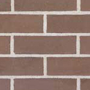

# Inhaltsverzeichnis

1. [Anforderungen an das Spielkonzept](Anforderungen an das Spielkonzept)
2. [Spielkonzept](Spielkonzept)
3. [Architektur und Implementierung](Architektur und Implementierung)  
   3.1 [Model](Model)  
   3.1.1 [Blade Entity](Blade Entity)  
   3.2 [View](View)  
   3.2.1 [HTML-Dokument](HTML-Dokument)  
   3.2.2 [DartBladeGameView als Schnittstelle zum HTML-Dokument](DartBladeGameView als Schnittstelle zum HTML-Dokument)  
   3.2.3 [Die verschiedenen Tiles](Die verschiedenen Tiles)  
   3.3 [Controller](Controller)  
   3.3.1 [Laufendes Spiel](Laufendes Spiel)  
4. [Nachweis der Anforderungen](Nachweis der Anforderungen)
5. [Verantwortlichkeiten im Projekt](Verantwortlichkeiten im Projekt)  

## Das Ground-Tile  

Das Ground-Tile ist das normale Hintergrund-Tile des Games auf dem sich der Blade frei bewegen kann. Es wird in keinem Fall eine Aktion ausgeführt.