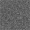
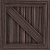

# Inhaltsverzeichnis

1. [Anforderungen an das Spielkonzept](Anforderungen an das Spielkonzept)
2. [Spielkonzept](Spielkonzept)
3. [Architektur und Implementierung](Architektur und Implementierung)  
   3.1 [Model](Model)  
   3.1.1 [Blade Entity](Blade Entity)  
   3.1.2 [Kollisions-Detektion](Kollisions-Detektion)  
   3.2.3 [Aufbau der Levels](Aufbau der Levels)  
   3.2 [View](View)  
   3.2.1 [HTML-Dokument](HTML-Dokument)  
   3.2.2 [DartBladeGameView als Schnittstelle zum HTML-Dokument](DartBladeGameView als Schnittstelle zum HTML-Dokument)  
   3.2.3 [Die verschiedenen Tiles](Die verschiedenen Tiles)  
   3.3 [Controller](Controller)  
   3.3.1 [Laufendes Spiel](Laufendes Spiel)  
4. [Nachweis der Anforderungen](Nachweis der Anforderungen)
5. [Verantwortlichkeiten im Projekt](Verantwortlichkeiten im Projekt)

## Das Ground-Tile  
 
Das Ground-Tile ist das normale Hintergrund-Tile des Games auf dem sich der Blade frei bewegen kann. Es wird in keinem Fall eine Aktion ausgeführt.  

## Das Goal-Tile  
  
Das Goal-Tile ist das zu erreichende Ziel-Feld des Spiels. Erreicht man durch das Bewegen des Blades das Goal-Tile **bevor der Spin des Blades auf 0 gelaufen ist**, so hat man das aktuelle Level gewonnen.  

## Das Spin-Tile  
  
Beim überfahren des Spin-Tiles mit dem Blade fängt das gesamte Level an zu wackeln. Dies passiert solange, bis man das selbe oder ein anderes Spin-Tile nocheinmal überfährt.  
Sinn dieses Tiles ist es z.B. das Goal-Tile s.o. mit Spin-Tiles einzugrenzen, und so die Steuerung des Blades zu erschweren.

## Das Gameover-Tile  
  
Sollte der Kreisel dieses Tile überfahren ist das Level verloren.